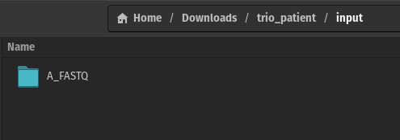
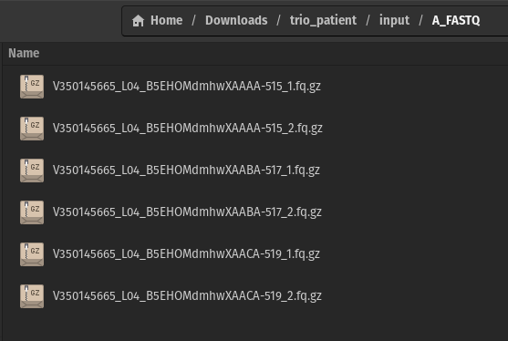

# IDeRare

IDeRare or *"Indonesia Exome Rare Disease Variant Discovery Pipeline"* is simple and ready to use variant discovery pipeline to discover rare disease variants from exome sequencing data.

## Authored by 
Ivan William Harsono<sup>a</sup>, Yulia Ariani<sup>b</sup>, Beben Benyamin<sup>c,d,e</sup>, Fadilah Fadilah<sup>f,g</sup>, Dwi Ari Pujianto<sup>b</sup>, Cut Nurul Hafifah<sup>h</sup>

<sup>a</sup>Doctoral Program in Biomedical Sciences, Faculty of Medicine, Universitas Indonesia, Jakarta, Indonesia.<br> 
<sup>b</sup>Department of Medical Biology, Faculty of Medicine, Universitas Indonesia, Jakarta, Indonesia.<br> 
<sup>c</sup>Australian Centre for Precision Health, University of South Australia, Adelaide, SA, 5000, Australia. <br>
<sup>d</sup>UniSA Allied Health and Human Performance, University of South Australia, Adelaide, SA, 5000, Australia. <br>
<sup>e</sup>South Australian Health and Medical Research Institute (SAHMRI), University of South Australia, Adelaide, SA, 5000, Australia. <br>
<sup>f</sup>Department of Medical Chemistry, Faculty of Medicine, Universitas Indonesia, Jalan Salemba Raya number 4, Jakarta, 10430, Indonesia.<br>
<sup>g</sup>Bioinformatics Core Facilities - IMERI, Faculty of Medicine, Universitas Indonesia, Jalan Salemba Raya number 6, Jakarta, 10430, Indonesia .<br>
<sup>h</sup>Department of Child Health, Dr. Cipto Mangunkusumo Hospital, Faculty of Medicine, University of Indonesia, Jakarta, Indonesia. <br>


**Note:** Currently IDeRare paper is being considered journal submission. The citation will be updated once the paper is published.

### Description
- This pipeline is designed to be used in Linux environment
- Original paper may used different version of tools, and the prerequisite used in this pipeline is the latest version of the tools
- This pipeline is designed and tested with Indonesia rare disease trio patient, but it should be also usable for general cases of rare disease variant discovery from Exome Sequences data given paired end .fq.gz file and HPO data(s)
- Ensure you have at least 250GB free for database and application setup, and 100GB free for each Trio family exome set
- The .yaml file path are assuming all the folder are stored in ```Downloads``` folder with subfolder of ```Database``` (for RefSeq, dbNSFP, dbSNP, ClinVar), ```Sandbox``` (for application and its database), ```IDeRare``` (git cloned folder)

### Data Example
- Explanation how to write the entry available at [Clinical Information Example section](#clinical-information-example) and file example at [example/clinical_data_example.txt](example/clinical_data_example.txt)
- Genotype data accessible from the SRR of Bioproject database [1077459](https://www.ncbi.nlm.nih.gov/bioproject/1077459) and SRA database: with accession number [SRR27997290-SRR27997292](https://www.ncbi.nlm.nih.gov/sra?linkname=bioproject_sra_all&from_uid=1077459). **Data paper submission of this samples without Author's permission is strictly prohibited.**

### Quick Installation
1. Clone this repository
```bash
git clone https://github.com/ivanwilliammd/IDeRare
```
2. Have a Linux environment (Ubuntu or Ubuntu-like 22.04 LTS distro is recommended)
3. Install [Docker](https://docs.docker.com/engine/install/ubuntu/) and [Anaconda - optional](https://docs.conda.io/projects/conda/en/latest/user-guide/install/linux.html)- see [Prerequisite.md](installation/Prerequisite.md) for more details
4. Run dependency installation script and database script
```bash
cd installation
source install_dependencies.sh
source download_database.sh
cd ../
```

### OPTIONAL - Phenotype Translation, Linkage Analysis, Phenotype Similarity Scoring, Gene-disease recommendation (iderare_pheno.py)
1. This script is recommended if you would like to do conversion, linkage analysis, similarity scoring, and gene-disease recommendation based on the phenotype data provided at [clinical_data.txt](clinical_data.txt). Full feature : 
    - Convert the phenotype data to HPO code (accept mixed SNOMED, LOINC, and HPO code)
    - Linkage analysis of differential diagnosis (accept mixed SNOMED, ICD10, ORPHA, OMIM code)
    - Similarity scoring of differential diagnosis
    - Gene-disease recommendation based on the phenotype data.
    - Similarity scoring of recommended causative gene and disease.
    - Linkage analysis of recommended causative gene and disease based on phenotype data.
    - Example of the clinical data provided at [Clinical Information Example section](#clinical-information-example)
2. Run ```iderare_pheno.sh``` (Interactive jupyter notebook available [here](backbone/iderare_pheno.ipynb))<br>
```bash
# Advance usage of the script : available at iderare_pheno.sh file
source iderare_pheno.sh
```
3. The output of this file will be saved on [output folder](output), with the file tree and explanation as following.
```
.
└── output
    ├── {datetime}_Linkage of DDx.png
    ├── {datetime}_Linkage of DDx with threshold .png
    ├── {datetime}_Linkage of Causative Gene with.png
    ├── {datetime}_Linkage of Causative Disease w.png
    ├── {datetime}_differential_diagnosis_similarity.tsv
    ├── {datetime}_differential_recommended_disease_similarity.tsv
    ├── {datetime}_differential_recommended_gene_similarity.tsv
    ├── {datetime}_transformed_hpo_set.tsv
    └── {datetime}_transformed_hpo_set.txt
```

| File name | Description |
|-----------|-------------|
| {datetime}_Linkage of DDx.png | Dendogram of the linkage analysis of DDx provided on clinical_data.txt (all) |
| {datetime}_Linkage of DDx with threshold .png | Dendogram of the linkage analysis of DDx provided on clinical_data.txt (threshold) |
| {datetime}_Linkage of Causative Gene with.png | Dendogram of potential causative top-n candidate gene related to patient's phenotype (from HPO OMIM database) |
| {datetime}_Linkage of Causative Disease w.png | Dendogram of potential causative top-n candidate disease related to patient's phenotype (from HPO OMIM database) |
| {datetime}_differential_diagnosis_similarity.tsv | TSV file of differential diagnosis similarity score |
| {datetime}_differential_recommended_disease_similarity.tsv | TSV file of all disease similarity score |
| {datetime}_differential_recommended_gene_similarity.tsv | TSV file of all gene similarity score |
| {datetime}_transformed_hpo_set.tsv | Converted clinical_data to readily used HPO code |
| {datetime}_transformed_hpo_set.tsv | Converted clinical_data to readily used HPO list for yml |

### Preparing the iderare.yml for phenotype-based-prioritization exome analysis pipeline
1. Set the data, directory file reference and trio information on ```iderare.yml```.<br><br> 
**Note** : all exome files should be located in the ```input/A_FASTQ``` folder of absolute path setup by ```data_dir``` at ```iderare.yml```. Example of filled yml available on [example/iderare_example.yml](example/iderare_example.yml)
<br><br>


1. Run the bash script
```bash
source iderare.sh 
```


## Appendix
<h3 id="clinical-information-example">Clinical Information Example</h3>

- Coded clinical information example in txt format provided at [example/clinical_data_example.txt](example/clinical_data_example.txt). 
- This clinical information is the patient phenotype and differential diagnoses complementing trio exome data provided at Bioproject database [1077459](https://www.ncbi.nlm.nih.gov/bioproject/1077459)

#### Phenotype Data
| Clinical Finding | Source of Information | Coded in | EMR Code | Interpretation | Writing format at ```clinical_data.txt``` |
|----------------------|------|------|----------|----------|----------|
| Autosomal recessive inheritance | Inheritance Pattern | SNOMED-CT  | 258211005 | |SNOMEDCT:258211005 |
| Hepatosplenomegaly | Physical Examination | SNOMED-CT | 36760000 | | SNOMEDCT:36760000 |
| Anemia | Physical Examination | SNOMED-CT | 271737000 | | SNOMEDCT:271737000 |
| Ascites | Physical Examination | SNOMED-CT | 389026000 | |SNOMEDCT:389026000 |
| Inadequate RBC production | Problem List | SNOMED-CT | 70730006 | |SNOMEDCT:70730006 |
| Abnormality of bone marrow cell morphology | Problem List | SNOMED-CT | 127035006 | |SNOMEDCT:127035006 |
| Cholestasis | Problem List | SNOMED-CT | 33688009 | |SNOMEDCT:33688009  |
| Abnormal liver function | Problem List | SNOMED-CT | 75183008 | |SNOMEDCT:75183008 |
| Impending hepatic failure | Problem List | SNOMED-CT | 75183008 | |SNOMEDCT:75183008 |
| Osteopenia | Problem List (Radiology Finding) | SNOMED-CT | 312894000 | |SNOMEDCT:312894000 |
| Mitral regurgitation | Problem List (Cardiology Finding) | SNOMED-CT | 56786000 | |SNOMEDCT:56786000 |
| Metabolic alkalosis | Problem List (Blood Gas Analysis) | SNOMED-CT | 1388004 | | SNOMEDCT:1388004 |
| Low Albumin Serum Level | Clinical Pathology (Lab) | LOINC | 1751-7 | L | LOINC:1751-7|L |
| Low HDL Level | Clinical Pathology (Lab) | LOINC | 2085-9 | L | LOINC:2085-9|L |
| Low Platelet Count | Clinical Pathology (Lab) | LOINC | 777-3 | L | LOINC:777-3|L |
| Increased Lactate Level | Clinical Pathology (Lab) | LOINC | 2519-7 | H | LOINC:2519-7|H |
| Increased ALT Level | Clinical Pathology (Lab) | LOINC | 1742-6 | H | LOINC:1742-6|H |
| Increased AST Level | Clinical Pathology (Lab) | LOINC | 1920-8 | H | LOINC:1920-8|H |
| Abnormal lower motor neuron | Disease Spectrum related to EMG result | HPO | 0002366 | | HP:0002366 |
| Increase Hepatic Glycogen Content | Liver Biopsy Pathology Interpretation | HPO | 0006568 | | HP:0006568 |
| Bone-marrow foam cells | Pathology Anatomy Bone Marrow Aspiration | HPO | 0004333 | | HP:0004333 |
| Failure to thrive during infancy | Developmental history | HPO | 0001531 | | HP:0001531 |

#### Working diagnosis before Exome Sequencing
| Differential Diagnosis | Code Type | EMR Code | Writing format at ```clinical_data.txt``` |
|----------------------|------|----------|----------|
| Beta thalassemia | SNOMED-CT | 65959000 |SNOMEDCT:65959000 |
| Gaucher Disease | SNOMED-CT | 190794006 |SNOMEDCT:190794006 |
| Niemann Pick Disease type C | SNOMED-CT | 66751000 |SNOMEDCT:66751000 |
| Glycogen storage diseases spectrum | ICD10 | E74.0 | ICD-10:E74.0 |